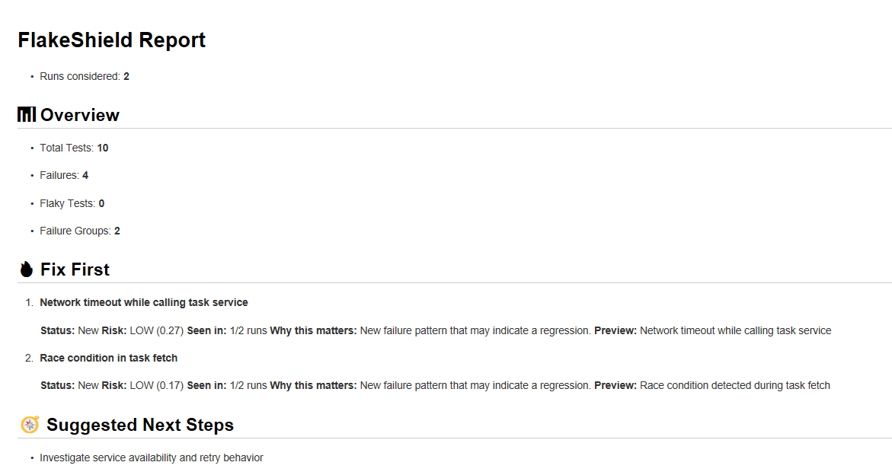

# FlakeShield Demo

## What is FlakeShield?

**The Problem:**
```
Raw CI output: 6 failures
```

**The Signal:**
```
FlakeShield: 3 root causes

Top Priority:
NullPointerException in payment validation
Risk: HIGH
```

FlakeShield reduces CI noise by:
1. **Parsing test results** — Extracts failure data from JUnit XML
2. **Normalizing signatures** — Removes noise (line numbers, paths, timestamps)
3. **Grouping by root cause** — Collapses duplicate failures
4. **Prioritizing risk** — Surfaces what actually matters

## Real Output Examples

Generated by [`deeoli/flakeshield-action@v0.6.0-beta.1`](https://github.com/deeoli/flakeshield-action) in the [FlakeShield Demo workflow](.github/workflows/flakeshield.yml). Screenshots are cropped from real `outputs/flake_report.md` and `outputs/pr_comment.md` artifacts.

### Priority and risk (`outputs/flake_report.md`)



Source: [examples/flake_report.md](./examples/flake_report.md)

### Investigation guidance


### Signal compression (3 failures → 1 root cause)


### PR comment (`outputs/pr_comment.md`)


Source: [examples/pr_comment.md](./examples/pr_comment.md)

## Before vs After

FlakeShield compresses noisy CI failures into prioritized root-cause analysis.

**[From CI Noise to Signal →](docs/showcase/transformation.md)**

Side-by-side showcase: [raw CI log](docs/showcase/raw-ci.txt) · [FlakeShield output](docs/showcase/flakeshield-output.txt)

## Product Walkthrough

See how FlakeShield transforms noisy CI output into prioritized investigation guidance.

**[Complete walkthrough →](docs/walkthrough/flakeshield-walkthrough.md)**

## Run it locally

**Python demo engine** (grouping, memory, risk, explanations):

```bash
python src/report.py
# Output: reports/failure-summary.txt
# Run twice to see recurring failure memory update
```

**Full CI demo** (Vitest + GitHub Actions + FlakeShield action):

```bash
npm install
npm run test:healthy
npm run test:flaky
```

Push to `main` or open a PR to trigger the workflow (`deeoli/flakeshield-action@v0.6.0-beta.1`). Download artifacts for `outputs/flake_report.md` and `outputs/pr_comment.md`.

## Phase 2 — Failure Memory

FlakeShield remembers historical failure signatures and distinguishes:

- New failures
- Recurring failures

This demonstrates how CI intelligence evolves beyond parsing into historical analysis.

## Phase 3 — Risk Prioritization

FlakeShield now:

- groups failures
- remembers recurring issues
- ranks what deserves attention first

Goal: Reduce investigation time by surfacing the highest-risk failure groups first.

## Phase 4 — Actionable Summaries

FlakeShield now translates failure data into concise investigation guidance.

Instead of:

```
Risk: HIGH
```

Engineers see:

```
Recurring failure affecting multiple tests.
```

Verify explanations:

```bash
python src/explain.py
```

## What this repo demonstrates

- **Failure parsing** — Extract test name, class, status, error message from JUnit XML
- **Signature normalization** — Remove variable parts (line numbers, paths, timestamps)
- **Failure grouping** — Group by root cause signature
- **Failure memory** — Track recurring vs new root causes across runs
- **Risk prioritization** — Rank failure groups by occurrence, blast radius, and recurrence
- **Actionable summaries** — Deterministic "why this matters" and top investigation insights
- **Signal compression** — 6 failures -> 3 root causes
- GitHub Actions integration with FlakeShield
- PR comment generation and artifact upload


## Repo structure

- `src/` – failure intelligence pipeline:
  - `parser.py` – Parse JUnit XML test results
  - `grouper.py` – Normalize signatures and group failures by root cause
  - `history.py` – Persist and classify recurring failure signatures
  - `risk.py` – Score and rank failure groups by deterministic risk
  - `explain.py` – Deterministic investigation guidance and top insights
  - `report.py` – Generate human-readable reports
  - `tasks.js` – Node test fixtures (async/timing scenarios)
- `data/` – Failure memory store (`failure-history.json`, created/updated by `report.py`)
- `sample-results/` – Demo JUnit XML (8 tests, 6 failures, 3 root causes)
- `reports/` – Generated failure summary reports
- `tests/` – stable tests and flaky scenario coverage
- `.github/workflows/flakeshield.yml` – workflow that runs tests twice and calls FlakeShield
- `audit/demo-runs/` – sample demo outputs for healthy and flaky runs

## Flaky scenarios implemented

- `fetchTaskStatus()` simulates random network timeout behavior
- `retryFetchTaskStatus()` exercises retry behavior under intermittent failure
- `fetchWithRace()` models race-condition failures between fast and stale requests
- Semantic failure cluster with repeated `Network timeout while calling task service` errors

## Expected outputs

- `test-results/junit-healthy.xml` from the healthy CI run
- `test-results/junit-flaky.xml` from the flaky CI run
- `outputs/flake_report.md` with grouped failures, semantic clustering, and risk prioritization
- `outputs/pr_comment.md` with compact GitHub-ready CI summaries
- Downloadable GitHub Actions artifacts containing reports and test results
- FlakeShield detection of repeated timeout and race-condition failures

## Trigger flaky behavior

The workflow does two runs:
1. Healthy run: `npm run test:healthy`
2. Flaky run: `npm run test:flaky`

In GitHub Actions, FlakeShield compares these runs and surfaces repeated failures.

---

> This demo is intentionally small, practical, and ready to use for public showcases.
