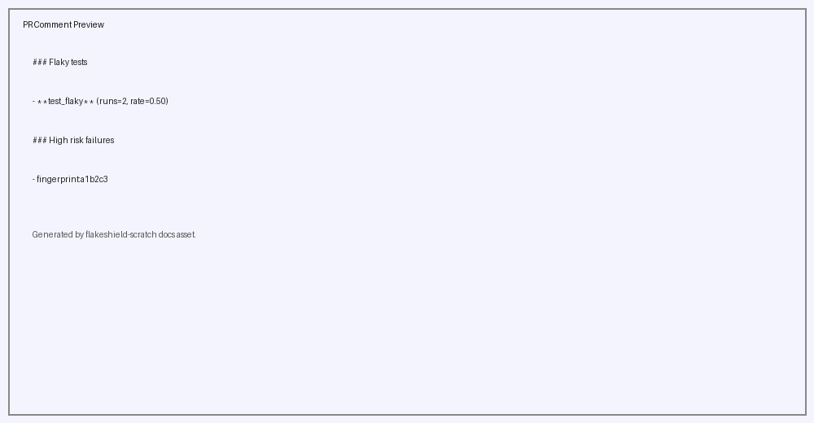

# FlakeShield Demo

## What is FlakeShield?

**The Problem:**
```
Raw CI output: 3 failures
```

**The Signal:**
```
FlakeShield: 2 root causes
```

FlakeShield reduces CI noise by:
1. **Parsing test results** — Extracts failure data from JUnit XML
2. **Normalizing signatures** — Removes noise (line numbers, paths, timestamps)
3. **Grouping by root cause** — Collapses duplicate failures
4. **Prioritizing risk** — Surfaces what actually matters

## Quick Demo

```bash
# Parse, group, and track failure memory
python src/report.py

# First run (no history yet)
Detected 2 failure groups
New root causes: 2
Recurring root causes: 0

# Second run (same sample-results/junit.xml)
Detected 2 failure groups
New root causes: 0
Recurring root causes: 2

# Full report saved to: reports/failure-summary.txt
```

## Phase 2 — Failure Memory

FlakeShield remembers historical failure signatures and distinguishes:

- New failures
- Recurring failures

This demonstrates how CI intelligence evolves beyond parsing into historical analysis.

## What this repo demonstrates

- **Failure parsing** — Extract test name, class, status, error message from JUnit XML
- **Signature normalization** — Remove variable parts (line numbers, paths, timestamps)
- **Failure grouping** — Group by root cause signature
- **Failure memory** — Track recurring vs new root causes across runs
- **Signal compression** — 3 failures -> 2 root causes
- GitHub Actions integration with FlakeShield
- PR comment generation and artifact upload


## Repo structure

- `src/` – failure intelligence pipeline:
  - `parser.py` – Parse JUnit XML test results
  - `grouper.py` – Normalize signatures and group failures by root cause
  - `history.py` – Persist and classify recurring failure signatures
  - `report.py` – Generate human-readable reports
  - `tasks.js` – Node test fixtures (async/timing scenarios)
- `data/` – Failure memory store (`failure-history.json`, created/updated by `report.py`)
- `sample-results/` – Demo JUnit XML (5 tests, 3 failures, 2 root causes)
- `reports/` – Generated failure summary reports
- `tests/` – stable tests and flaky scenario coverage
- `.github/workflows/flakeshield.yml` – workflow that runs tests twice and calls FlakeShield
- `audit/demo-runs/` – sample demo outputs for healthy and flaky runs

## How to run locally

```bash
cd flakeshield-demo
npm install
npm run test:healthy
npm run test:flaky
```

The `test:healthy` run uses a clean service path. The `test:flaky` run introduces timing and network race conditions.

## Flaky scenarios implemented

- `fetchTaskStatus()` simulates random network timeout behavior
- `retryFetchTaskStatus()` exercises retry behavior under intermittent failure
- `fetchWithRace()` models race-condition failures between fast and stale requests
- Semantic failure cluster with repeated `Network timeout while calling task service` errors

## Expected outputs

- `test-results/junit-healthy.xml` from the healthy CI run
- `test-results/junit-flaky.xml` from the flaky CI run
- `outputs/flake_report.md` with grouped failures, semantic clustering, and risk prioritization
- `outputs/pr_comment.md` with compact GitHub-ready CI summaries
- Downloadable GitHub Actions artifacts containing reports and test results
- FlakeShield detection of repeated timeout and race-condition failures

## Trigger flaky behavior

The workflow does two runs:
1. Healthy run: `npm run test:healthy`
2. Flaky run: `npm run test:flaky`

In GitHub Actions, FlakeShield compares these runs and surfaces repeated failures.

## Real Output Examples

### Healthy Run


No failures, no flaky tests, stable history.

### Failure Analysis


FlakeShield surfaces recurring failures, flaky behaviour, and high-risk issues.

### PR Comment Output



Compact pull request summaries highlighting what deserves attention first.

- [flake_report.md](./examples/flake_report.md)
- [pr_comment.md](./examples/pr_comment.md)

---

> This demo is intentionally small, practical, and ready to use for public showcases.
