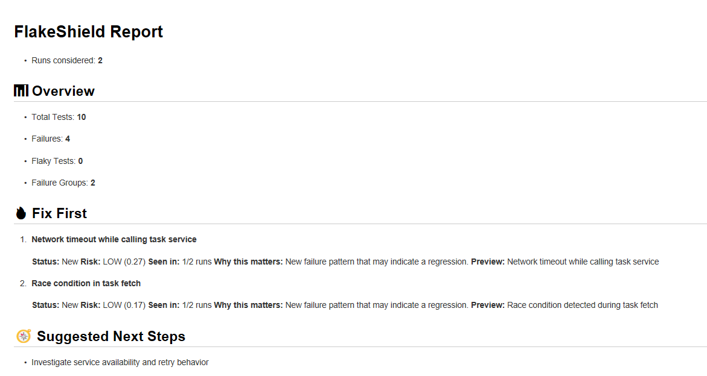
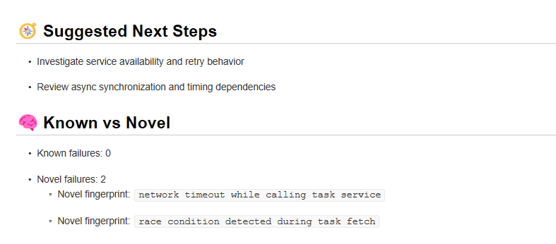
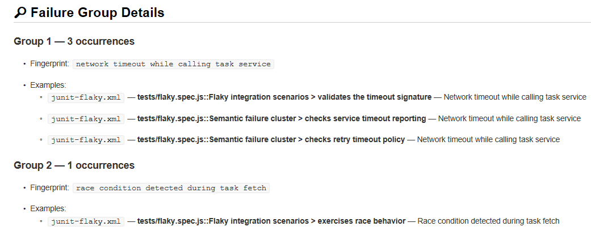
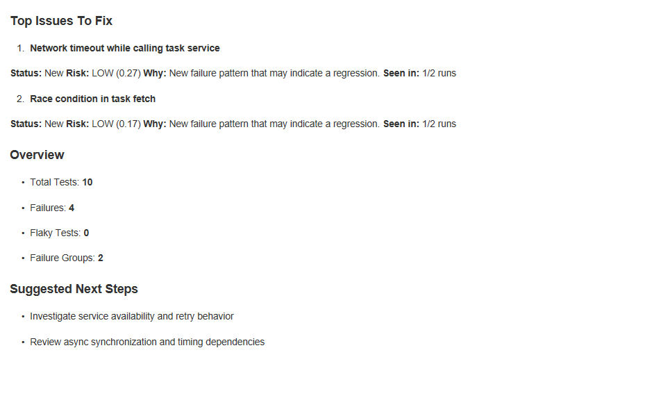

# Screenshot Capture Guide

## Workflow

The GitHub Actions workflow (`flakeshield.yml`) has been updated to use **FlakeShield v0.6.0-beta.3**.

When the workflow runs, it generates:
- `outputs/flake_report.md` — full analysis report
- `outputs/pr_comment.md` — compact PR comment

These are uploaded as GitHub Actions artifacts.

## Capture Process

### Step 1: Trigger CI Run

```bash
git push origin main
```

Monitor the Actions tab at: https://github.com/deeoli/flakeshield-demo/actions

### Step 2: Download Artifacts

Once workflow completes:
1. Open the successful run
2. Click "Artifacts" section
3. Download `flakeshield-demo-output`
4. Extract to get `outputs/flake_report.md` and `outputs/pr_comment.md`

### Step 3: Render and Screenshot

Open the markdown files in a markdown renderer or GitHub preview:

**Screenshot 1: Overview and Fix First**
- File: `outputs/flake_report.md`
- Content to capture:
  - Title
  - Overview and status
  - 🔥 Fix First section
  - Risk scores (LOW, MEDIUM, HIGH)
  - "Why this matters" explanations
- Dimensions: 800px width, tight crop
- Save to: `docs/screenshots/fix-first.png`

**Screenshot 2: Investigation Guidance**
- File: `outputs/flake_report.md`
- Content to capture:
  - Suggested next steps
  - Known vs novel failures
- Dimensions: 800px width, tight crop
- Save to: `docs/screenshots/investigation-guide.png`

**Screenshot 3: Failure Grouping**
- File: `outputs/flake_report.md`
- Content to capture:
  - 🧠 Semantic failure groups section
  - Grouped root cause details (e.g. 3 failures → 1 root cause)
- Dimensions: 800px width, tight crop
- Save to: `docs/screenshots/failure-grouping.png`

**Screenshot 4: PR Comment**
- File: `outputs/pr_comment.md`
- Content to capture:
  - Comment header
  - Top issues and overview
  - Suggested next steps
  - [View full report] link
- Dimensions: 800px width (GitHub default)
- Save to: `docs/screenshots/pr-summary.png`

### Step 4: Edit README

Replace placeholders in README.md with actual screenshot references:

```markdown
## Real Output Examples








```

## Success Criteria

✓ Images are PNG format  
✓ Text is readable at 800px width on GitHub  
✓ No giant whitespace — tight crops  
✓ Shows real FlakeShield output, not synthetic mockups  
✓ Visitor can understand value in < 10 seconds  

## Tools for Screenshot Capture

**Option 1: Browser DevTools**
1. Open markdown file in browser preview
2. Right-click → Inspect → Select element
3. DevTools Elements panel
4. Screenshots tool → Capture node to file

**Option 2: Screenshot Tool + Crop**
1. Use OS screenshot tool (Windows: Snip & Sketch, Mac: Cmd+Shift+4)
2. Crop to tight bounds in image editor
3. Save as PNG

**Option 3: Headless Browser**
```bash
# Using Puppeteer or similar
npx puppeteer-cli screenshot --format png --scale 1 file://outputs/flake_report.md
```

---

**Next:** Push changes, wait for CI, download artifacts, take screenshots.
